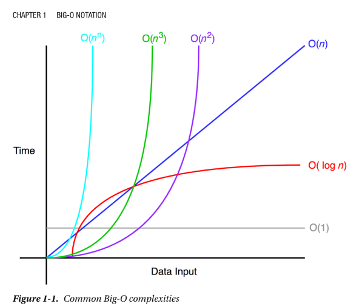

 # Big O Notation
 La notación Big O mide la complejidad de un escenario en el peor de los casos.
 En la notación Big O, *n* representa el numero de entradas. La cuestión que se pregunta en la notación Big O es la siguiente: "¿Qué pasaría si *n* se aproxima a infinito?"
 Cuando se implementa un algoritmo, la notación Big O es importante porque te dice qué tan eficiente es el algoritmo en sí.

### O(1) *Tiempo constante*

O(1) No cambia con respecto al espacio de entrada. Un ejemplo de este es accediendo a un elemento de un arreglo por su índice. 
> Vea ejemplo en [función constante](./01-big-o-notation.js)

### O(*n*) *Tiempo lineal*
O(*n*) es tiempo lineal y aplica a algoritmos que deben hacer *n* operaciones en el peor de los casos.

> Un ejemplo de un algoritmo O(*n*) podría ser imprimir numeros del 0 al *n*-1, como se muestra en el ejemplo [función lineal](./01-big-o-notation.js)

### O(*n*^2) y O(*n*^3) *Tiempo cuadratico y cúbico*
> Vea ejemplo en [función cuadratica y cubica](./01-big-o-notation.js)

### O(log *n*) *Tiempo logaritmico*
La eficiencia de complejidades de tiempo logaritmico es aparentemente con entradas grandes como millones de items. Aunque *n* es un millón, la función de ejemplo imprimirá solo 19 objetos porque log2(1000000) = 19.9315686.
> Vea ejemplo en [función logaritmica](./01-big-o-notation.js)

## Reglas de notación Big O
Vamos a representar la complejidad de un algoritmo como $f(n)$. *n* representa el numero de entradas, $f(n)_{tiempo}$ representa el tiempo necesitado, y $f(n)_{espacio}$ representa el espacio (memoria adicional) necesitada por el algoritmo. El objetivo del analisis de algoritmo es entender la eficiencia del algoritmo al calcular $f(n)$. Sin embargo puede ser desafiante calcular $f(n)$. Big O provee algunas reglas fundamentales que nos pueden ayudar a computar $f(n)$:

- *Regla del coeficiente*: Si $f(n)$ es $O(g(n))$, entonces $kf(n)$ es $O(g(n))$, para cualquier constante *k* > 0. La primera regla es la *regla del coeficiente*, la cual elimina coeficientes no relacionados con la cantidad de la entrada, *n*. Esto se debe a que cuando n tiende a infinito, el otro coeficiente se vuelve insignificante. 
- *Regla de la suma*: Si $f(n)$ es $O(h(n))$ y $g(n)$ es $O(p(n))$, entonces $f(n) + g(n)$ 
- *Regla del producto*: 
- *Regla transitiva*: 
- *Regla polinomial*: 
- *Regla de logaritmo de una potencia*: 

